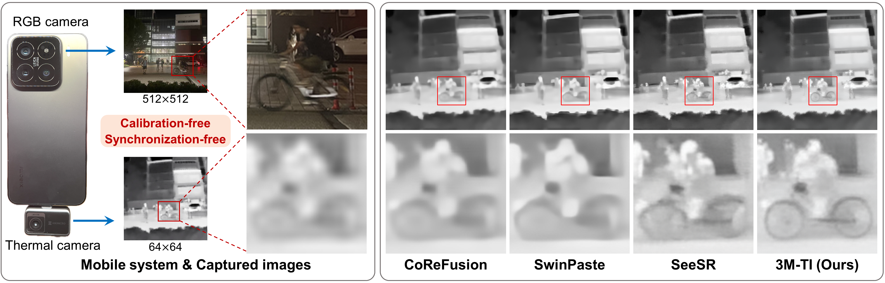
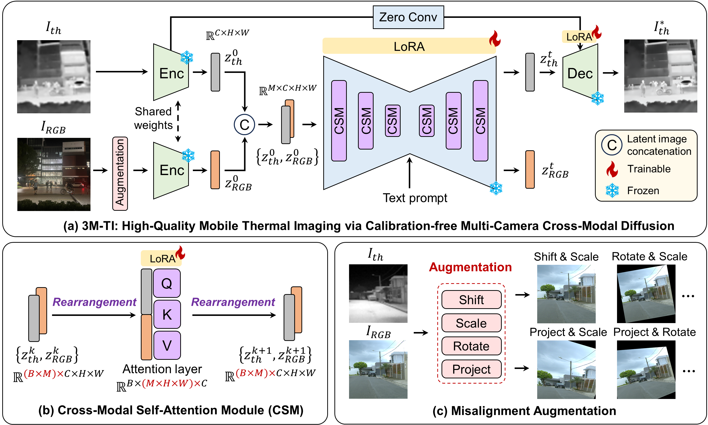

# 3M-TI: High-Quality Mobile Thermal Imaging via Calibration-free Multi-Camera Cross-Modal Diffusion

Papers: [Arxiv](https://arxiv.org/abs/2511.19117)

Authors: [Minchong Chen](https://scholar.google.com.hk/citations?hl=zh-CN&user=UX2ZtJcAAAAJ) | [Xiaoyun Yuan](https://xiaoyunyuan.net/) | [Junzhe Wan](https://scholar.google.com.hk/citations?view_op=list_works&hl=zh-CN&hl=zh-CN&user=QbbWdzEAAAAJ) | [Jianing Zhang]() | [Jun Zhang]()

## 📱Mobile Thermal Imaging System


## 🔎Framework Overview


## 📚Qualitative Results on Synthetic Dataset


## 📷Qualitative Results on Mobile Imaging System


## ⚙️Setup
```bash
git clone https://github.com/work-submit/3MTI.git
cd 3MTI
conda create -n 3MTI python=3.10 pytorch=2.7.1 pytorch-cuda=11.8 -c pytorch -c nvidia
conda activate 3MTI
pip install -r requirements.txt
```

## Dataset Preparation
Prepare your training set and test set in the following JSON format:
```json
{
    "train": {
        "target_image": "path_to_target_high_resolution_thermal_image_folder",
        "image": "path_to_degraded_low_resolution_thermal_image_folder",
        "ref_image": "path_to_reference_high_resolution_RGB_image_folder",
        "prompt": "remove degradation"
    },
    "test": {
        "target_image": "path_to_target_high_resolution_thermal_image_folder",
        "image": "path_to_degraded_low_resolution_thermal_image_folder",
        "ref_image": "path_to_reference_high_resolution_RGB_image_folder",
        "prompt": "remove degradation"
    }
}
```
#### Step 1: Create a JSON file containing the dataset path.
```
cd dataset
python create_json.py
```

## Semantic Extraction
Extract semantic information from the reference RGB images:
#### Step 1: Download the pretrained models
- Download the pretrained RAM (14M) model weight from [HuggingFace](https://huggingface.co/spaces/xinyu1205/recognize-anything/blob/main/ram_swin_large_14m.pth).
- Download the DAPE model weight from [GoogleDrive](https://drive.google.com/drive/folders/12HXrRGEXUAnmHRaf0bIn-S8XSK4Ku0JO?usp=drive_link).
- You can put these models into `3MTI/trained_model/`.
#### Step 2: Modify path
- Replace lines 16 to 21 of semantic_extract.py with your actual path.
```
IMAGE_DIR = 'path_to_your_reference_image_folder'
OUTPUT_FILE_PATH = 'output_path_to/prompt.txt'
PRETRAINED_MODEL_PATH = 'path_to/ram_swin_large_14m.pth'
DAPE_CKPT_PATH = 'path_to/DAPE.pth'
```
#### Step 3: Extraction
```
cd src
python semantic_extract.py
```
Your prompt.txt content should be formatted as follows:
```
00001.png: word1, word2, word3, ...
00002.png: word1, word2, word3, ...
...
XXXXX.png: word1, word2, word3, ...
```

## 🚀Inference
#### Step 1: Download the pretrained model
- Download the pretrained 3MTI model from [pretrained weights and data](https://pan.sjtu.edu.cn/web/share/7df7f0df32ac4cd4eecc243f5ff95483).
- You can put this model into `3MTI/trained_model/`.
#### Step 2: Modify path
- Replace lines 90 and 91 of inference_3MTI.py with your actual semantic prompt text path.
```
if os.path.exists("./prompt.txt"):
    with open("prompt.txt", "r") as f:
```
#### Step 3: Inference and save results
```bash
python inference_3MTI.py \
--model_path "path_to/trained_model/model.pkl" \
--input_image "path_to_your_low_resoluton_thermal_image_folder" \
--ref_image "path_to_your_high_resoluton_reference_RGB_image_folder" \
--prompt "remove degradation" \
--output_dir "path_to_inference_output_folder" \
--mv_unet
```

## 🌈 Train
#### Step 1: Modify path
- Replace lines 101 and 104 of train_3MTI.py with your actual semantic prompt text path.
```
dataset_train = PairedDataset(dataset_path=args.dataset_path, split="train", tokenizer=net_difix.tokenizer, prompts_file="path_to/training_prompt.txt")
dataset_val = PairedDataset(dataset_path=args.dataset_path, split="test", tokenizer=net_difix.tokenizer, prompts_file="path_to/test_prompt.txt")
```
#### Step 2: training
#### Single GPU
```bash
accelerate launch --mixed_precision=bf16 train_3MTI.py \
    --output_dir="path_to/saved_weights" \
    --dataset_path="path_to/your_dataset.json" \
    --max_train_steps 10000 \
    --resolution=512 --learning_rate 2e-5 \
    --train_batch_size=4 --dataloader_num_workers 0 \
    --enable_xformers_memory_efficient_attention \
    --checkpointing_steps=1000 --eval_freq 2000 --viz_freq 10000 \
    --lambda_lpips 1.0 --lambda_l2 1.0 --lambda_gram 1.0 --gram_loss_warmup_steps 2000 \
    --tracker_project_name "difix" --tracker_run_name "train" --timestep 199 --mv_unet
```
#### Multipe GPUs
```bash
export NUM_NODES=1
export NUM_GPUS=8
accelerate launch --mixed_precision=bf16 --main_process_port 29501 --multi_gpu --num_machines $NUM_NODES --num_processes $NUM_GPUS src/train_difix.py \
    --output_dir="path_to/saved_weights" \
    --dataset_path="path_to/your_dataset.json" \
    --max_train_steps 10000 \
    --resolution=512 --learning_rate 2e-5 \
    --train_batch_size=4 --dataloader_num_workers 0 \
    --enable_xformers_memory_efficient_attention \
    --checkpointing_steps=1000 --eval_freq 2000 --viz_freq 10000 \
    --lambda_lpips 1.0 --lambda_l2 1.0 --lambda_gram 1.0 --gram_loss_warmup_steps 2000 \
    --tracker_project_name "difix" --tracker_run_name "train" --timestep 199 --mv_unet
```
## 🎒 Data open source
Our datasets used for training and validation are available at [pretrained weights and data](https://pan.sjtu.edu.cn/web/share/7df7f0df32ac4cd4eecc243f5ff95483).
